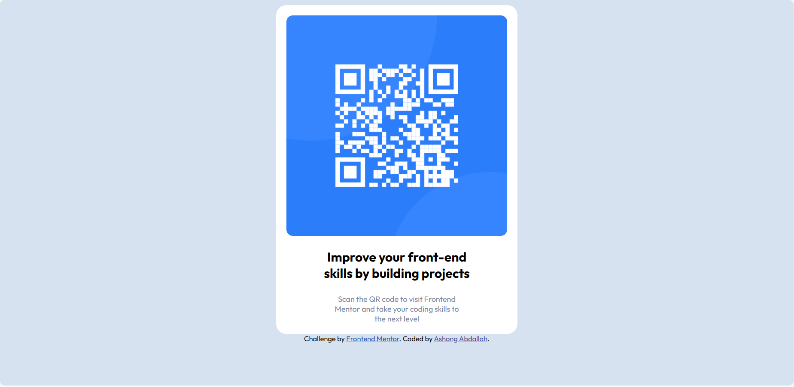

# Frontend Mentor - QR code component solution

## Table of contents

- [Overview](#overview)
  - [Screenshot](#screenshot)
  - [Links](#links)
<!-- - [My process](#my-process) -->
  - [Built with](#built-with)
  - [What I learned](#what-i-learned)
  - [Continued development](#continued-development)
  - [Useful resources](#useful-resources)
- [Author](#author)


## Overview

### Screenshot



### Links
- Solution URL: (https://github.com/AshongAbdallah06/qr-code-component-main/blob/New-Branch/README-template.md)
- Github URL: (https://github.com/AshongAbdallah06/qr-code-component-main)

<!-- ## My process -->

### Built with
- HTML
- CSS custom properties
- Flexbox

### What I learned:
```Learnt some useful stuff:```
  Importing and using fonts from google in HTML
  **(Font type: Outfit 100, 400 and 700)**,
  Some new css properties(```border-radius: 1rem;```)
  HSL colors

```html 
  <link rel="preconnect" href="https://fonts.googleapis.com">
  <link rel="preconnect" href="https://fonts.gstatic.com" crossorigin>
  <link href="https://fonts.googleapis.com/css2?family=Outfit:wght@100;400;700&display=swap" rel="stylesheet">
```
```css
.proud-of-this-css {
  border-radius: 1rem;
}
```

### Continued development
AIM: Is to improve more on styling my webpages using advanced libraries such as (**Bootstrap and many more**)
**Concepts that need more improvements**
Using fonts from Google
FlexBox
CSS color properties


### Useful resources
- [HSL Colors](https://www.w3schools.com/colors/colors_hsl.asp) - This helped me to get a fair understanding of HSL(Hue, Saturation, Lightness). I really liked this pattern and will use it going forward.


## Author
<!-- - Website - [Add your name here](https://www.your-site.com) -->
- Frontend Mentor - [@AshongAbdallah06](https://www.frontendmentor.io/profile/AshongAbdallah06)
- Twitter - [@XuGaR_2_0_0_6](https://www.twitter.com/XuGaR_2_0_0_6)
